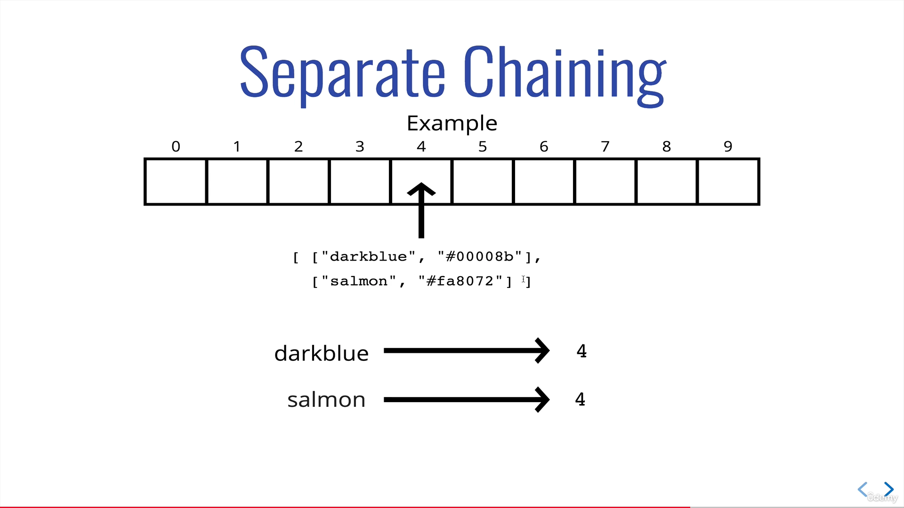
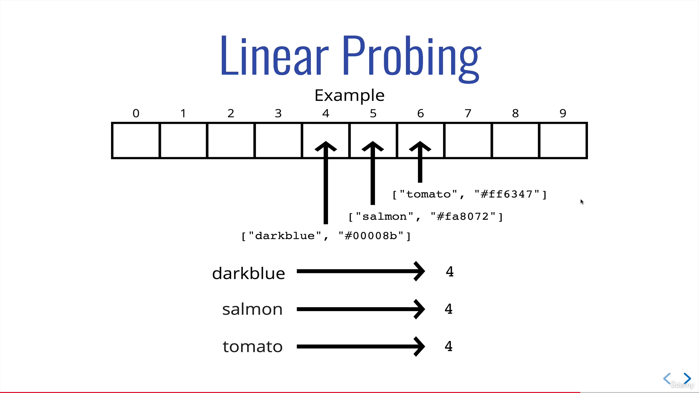

# Handling Collisions in Hash Tables

## Introduction

Collisions are inevitable in hash tables, even with an excellent hash function. Since we are working with a small hash table and a basic hash function, collisions are guaranteed. Here, we discuss two primary strategies for handling collisions: **Separate Chaining** and **Linear Probing**.

---

## 1. Separate Chaining

Separate Chaining allows multiple key-value pairs to exist at the same index by using a nested data structure, such as an array or a linked list.



### How it Works:

1. If two keys hash to the same index, both are stored in a nested data structure at that index.
2. When retrieving a key, we:
   - Hash the key to find the index.
   - Loop through the nested structure to find the key.
   - Return the corresponding value.

### Example:

```
Index  | Stored Data
----------------------
0      | []
1      | []
2      | []
3      | []
4      | [['dark blue', value1], ['salmon', value2]]
5      | []
...
```

If we hash 'dark blue' and 'salmon' both to index `4`, they are stored as an array at that position.

### Pros:

- Can store more items than the array length.
- Dynamically accommodates additional key-value pairs.

### Cons:

- Searching involves iterating through the list at an index, making worst-case lookup **O(n)**.

---

## 2. Linear Probing

Linear Probing avoids nested structures by ensuring that only **one key-value pair** is stored at each index. If a collision occurs, it finds the next available empty slot.



### How it Works:

1. If a key hashes to an occupied index, we check the next index.
2. This process continues until an empty slot is found.
3. When retrieving a key, we:
   - Hash the key to find the index.
   - If it's occupied by a different key, move forward until the correct key is found.

### Example:

```
Index  | Stored Data
----------------------
0      | []
1      | []
2      | []
3      | []
4      | ['dark blue', value1]
5      | ['salmon', value2]
6      | ['tomato', value3]
```

If 'dark blue' hashes to index `4`, but then 'salmon' also hashes to `4`, 'salmon' is stored at the next available slot (`5`).

### Pros:

- Simpler than separate chaining in terms of structure.
- Better cache performance since all data stays within the main array.

### Cons:

- Once the table is full, new insertions cannot be handled unless resizing is implemented.
- Clustering issues arise when too many keys probe to the same area.

---

## Choosing an Approach

- **Separate Chaining** is ideal for storing more items than the array length and is commonly used in practice.
- **Linear Probing** is space-efficient but requires a well-managed table size.

For implementation, use **Separate Chaining** as it allows storing more data than the table length.

---

## Implementation Code - [See Here](../hash_collison.js)
